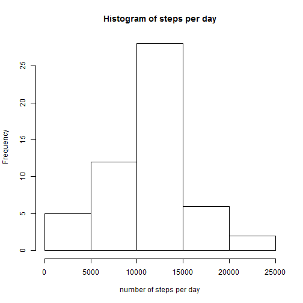
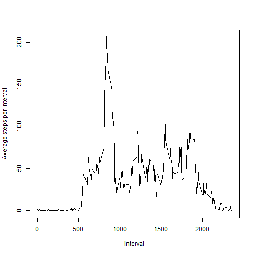
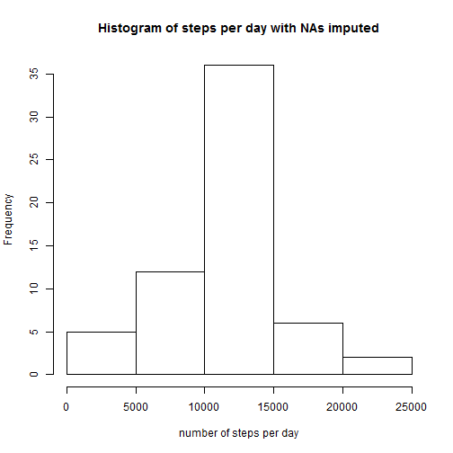
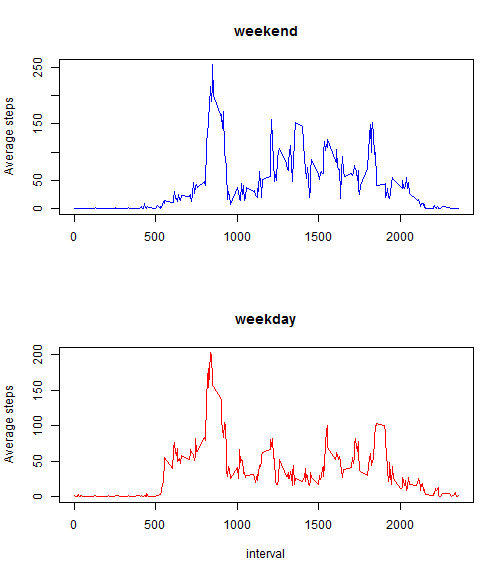

# Reproducible Research: Peer Assessment 1

## **by Haim Kotler, 2 June 2017** 

## Loading and preprocessing the data


```r
unzip("activity.zip", exdir = "./temp")
activityData <- read.csv("./temp/activity.csv")
unlink("./temp")

activityData$date <- as.Date(activityData$date)
```

## What is mean total number of steps taken per day?


```r
stepsPerDay<- with(activityData, aggregate(steps~date, FUN = sum))

hist(stepsPerDay$steps, xlab = "number of steps per day", main = "Histogram of steps per day")
```



```r
sspd <- summary(stepsPerDay$steps)
```
<span style="color:red">
**The mean of the total number of steps taken each day is 10770 and the median is 10760**
</span>

## What is the average daily activity pattern?

```r
stepsPerInt  <- with(activityData, aggregate(steps~interval, FUN = mean))

with(stepsPerInt, plot(steps~interval, type = "l", ylab = "Average steps per interval"))
```



```r
mSteps <- stepsPerInt[order(stepsPerInt$steps, decreasing = TRUE),][1,]
```
<span style="color:red">
**Interval no. 835 has the maximum numbers of steps on average, with 206 steps**
</span>

## Imputing missing values

```r
sna <- is.na(activityData$steps)

## imput NA rows with meas steps per interval

z <- dplyr::left_join(activityData, stepsPerInt, by = "interval")

aDataImpNA <- activityData
aDataImpNA[sna,"steps"] <- round(z[sna,"steps.y"])
```

<span style="color:red">
**total number of rows with NA steps is 2304**
</span>


```r
stepsPerDay2 <- with(aDataImpNA, aggregate(steps~date, FUN = sum))
hist(stepsPerDay2$steps, xlab = "number of steps per day", main = "Histogram of steps per day with NAs imputed")
```



```r
sspd2 <- summary(stepsPerDay2$steps)
```
<span style="color:blue">
**The mean of the total number of steps taken each day, after imputing NAs is 10770 and the median is 10760**

<span style="color:blue">
**The Difference between these values and the values before imputing NAs is 0 for the mean and 0 for the median** 

</span>

## Are there differences in activity patterns between weekdays and weekends?


```r
## Weekend if set to Friday and Saturday - this is common in Israel, where I live.
## Because of Locale issues I reframe from writing the names of the weekdays (in Hebrew on my system...).
## So I do a workaround by reading weekdays from known dates.

myweekend <- c(weekdays(as.Date("2017-06-02")), weekdays(as.Date("2017-06-03")))
we <- weekdays(aDataImpNA[,"date"]) %in% myweekend

aDataImpNA <- data.frame(aDataImpNA, c("weekday", "weekend")[we + 1])

stepsPerIntWE  <- with(aDataImpNA[we,], aggregate(steps~interval, FUN = mean))
stepsPerIntWD  <- with(aDataImpNA[!we,], aggregate(steps~interval, FUN = mean))

par(mfrow = c(2, 1))
with(stepsPerIntWE, plot(steps~interval, type = "l", ylab = "Average steps", main = "weekend", xlab = NA, col = "blue"))
with(stepsPerIntWD, plot(steps~interval, type = "l", ylab = "Average steps", main = "weekday", col = "red"))
```


